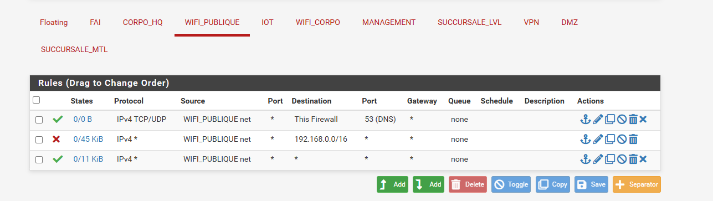

# Livrable 14 : Configuration des Points d’Accès UniFi

## 1. Objectif

Configurer deux points d’accès UniFi afin de fournir deux réseaux Wi-Fi distincts :

- Un réseau Wi-Fi public
- Un réseau Wi-Fi réservé aux employés

La configuration repose sur une segmentation par VLAN et une gestion centralisée via le contrôleur UniFi Network.

---

## 2. Prérequis

- Le contrôleur UniFi Network installé au livrable 13 est opérationnel et accessible via l’interface web.  
- Les deux points d’accès UniFi AP sont connectés au réseau filaire.  
- Les ports de gestion UniFi sont ouverts.  
- Les VLANs nécessaires sont créés et fonctionnels sur l’infrastructure réseau.  
- Les points d’accès ont été détectés automatiquement par le contrôleur puis adoptés avec succès.

---

## 3. Segmentation réseau (VLAN)

| Usage           | SSID                      | VLAN  |
|-----------------|---------------------------|-------|
| Wi-Fi public    | 420-6r1-ALRIAN-PUBLIC    | 100   |
| Wi-Fi employés  | 420-6r1-ALRIAN-EMPLOYES  | 110   |

- Les ports reliant les points d’accès UniFi au switch sont configurés en **trunk 802.1Q**, avec les VLANs nécessaires autorisés.  
- Le **VLAN natif est le VLAN 60**, utilisé pour la gestion (management) des points d’accès et la communication avec le contrôleur UniFi.

---

## 4. Configuration des SSID

### 4.1 SSID Public

- **Nom** : 420-6r1-ALRIAN-PUBLIC  
- **VLAN associé** : 100  
- **Sécurité** : WPA2  
- **Isolation activée** :  
  - Client Device Isolation  
  - Multicast and Broadcast Blocker  

> Ce réseau est isolé du réseau interne et ne permet aucun accès aux ressources internes.

### 4.2 SSID Employés

- **Nom** : 420-6r1-ALRIAN-EMPLOYES  
- **VLAN associé** : 110  
- **Sécurité** : WPA2/WPA3 avec clé partagée  

> Ce réseau permet l’accès aux ressources internes de l’entreprise.

---

## 5. Paramétrage des points d’accès

- Les deux points d’accès UniFi AP ont été adoptés par le contrôleur.  
- Les deux SSID sont diffusés simultanément par chaque point d’accès.  
- Aucune configuration spécifique par AP n’a été nécessaire, la configuration étant centralisée.

---

## 6. Tests de connectivité

### Wi-Fi Public

- Connexion réussie au SSID public  
- Attribution d’une adresse IP du VLAN 100  
- Accès à Internet fonctionnel  
- Accès aux ressources internes bloqué  

### Wi-Fi Employés

- Connexion sécurisée au SSID employés  
- Attribution d’une adresse IP du VLAN 110  
- Accès aux ressources internes fonctionnel  

> Les tests confirment la bonne segmentation et l’isolation du réseau public.

---

## 7. Règles de pare-feu pour le VLAN Wi-Fi Public (VLAN 100)

Pour assurer l’isolation du Wi-Fi public tout en maintenant l’accès Internet :  

| Ordre | Action | Interface        | Protocole | Source            | Destination     | Port | Description                       |
|-------|--------|-----------------|-----------|-----------------|----------------|------|-----------------------------------|
| 1     | Pass   | WIFI_PUBLIQUE   | TCP/UDP   | WIFI_PUBLIQUE net | This Firewall   | 53   | Autoriser DNS via pfSense         |
| 2     | Block  | WIFI_PUBLIQUE   | Any       | WIFI_PUBLIQUE net | 192.168.0.0/16 | Any  | Bloquer accès aux réseaux internes |
| 3     | Pass   | WIFI_PUBLIQUE   | Any       | WIFI_PUBLIQUE net | Any            | Any  | Autoriser Internet                 |

> Cette configuration permet :  
> - La résolution DNS via pfSense  
> - L’accès Internet pour les clients du Wi-Fi public  
> - Le blocage complet du réseau interne (VLAN employés, VLAN management, etc.)

