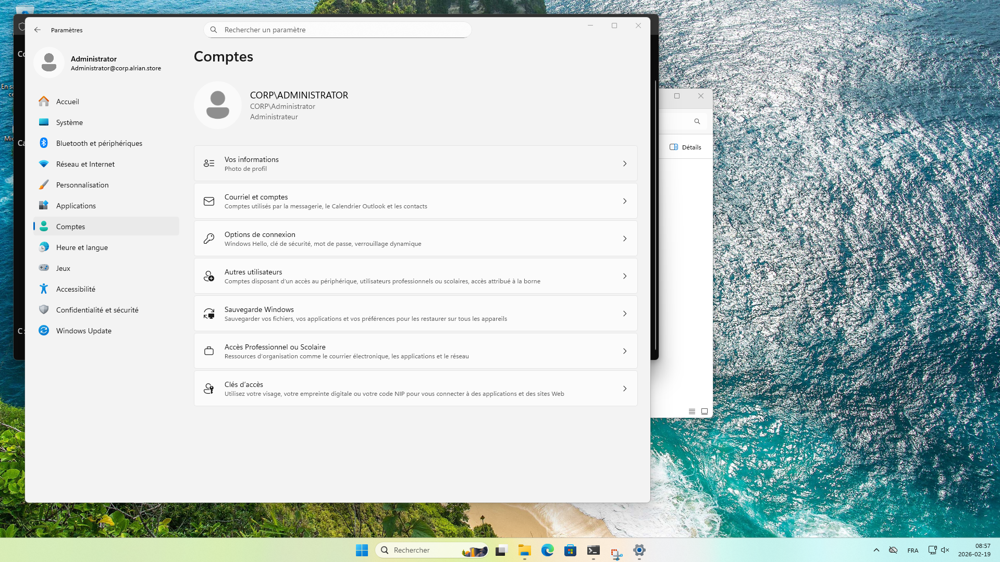
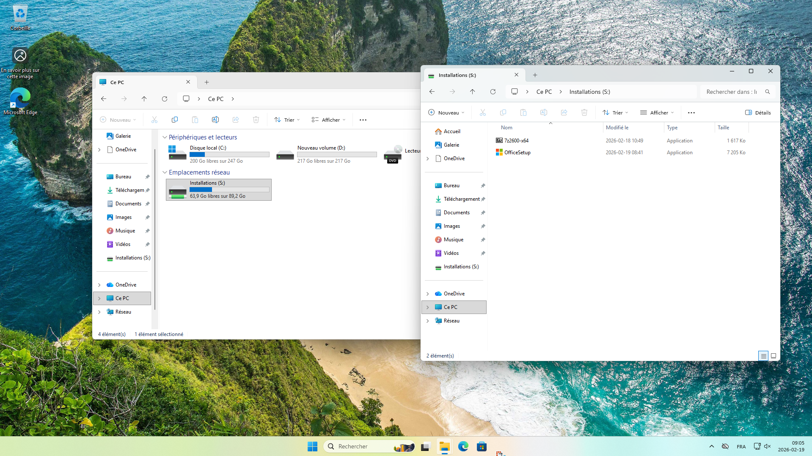
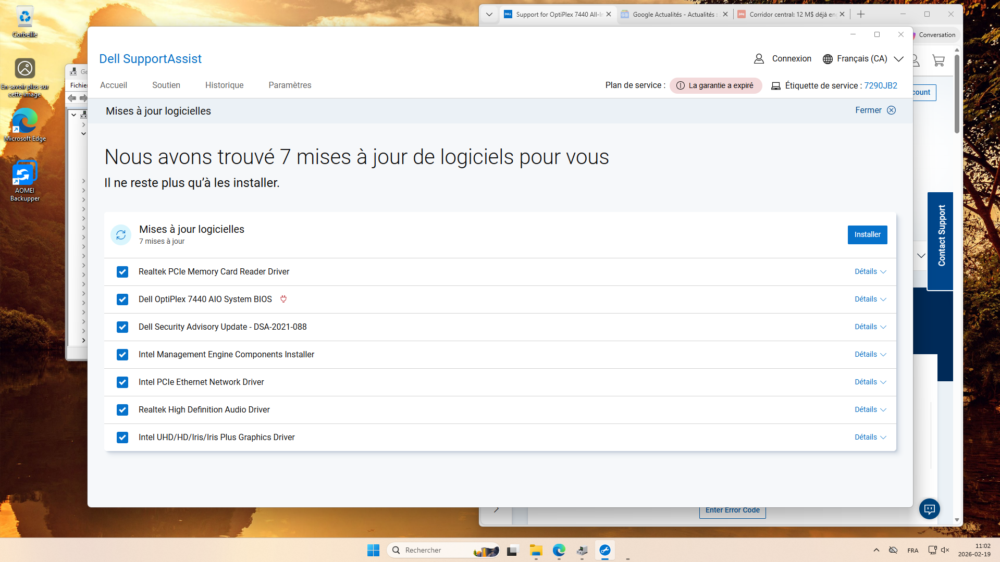

# Installation et configuration de la station de travail

## 1. Informations générales sur la station

| Élément | Détail |
|---------|--------|
| Modèle et caractéristiques techniques | Dell OptiPlex 7440 All-In-One, Intel Core i7, 16 Go RAM, SSD 512 Go |
| Version de Windows installée | Windows 11 Enterprise |
| Nom de la machine sur le réseau | PC-S0-01 |
| Adresse IP | 192.168.60.107 (DHCP) |

**Capture d’écran `ipconfig /all` :**  

---

## 2. Partitionnement du disque

| Partition | Taille | Utilisation |
|-----------|--------|-------------|
| C: (Système) | 50% | Windows et logiciels |
| D: (DATA) | 50% | Données de sauvegarde |

**Capture d’écran des partitions :**  

---

## 3. Jointure au domaine Active Directory et configuration de la GPO

- **Nom du domaine :** corp.alrian.store  
- Lecteur réseau **S: Installations** configuré via GPO. Contient :  
  - Office 365  
  - 7-Zip  

**Capture d’écran de la jointure au domaine :**  

**Capture d’écran du lecteur réseau S: Installations :**  

---

## 4. Installation des pilotes (drivers)

- **Source des pilotes téléchargés :** Site officiel Dell – catégorie “Drivers & Downloads” pour OptiPlex 7440 All-In-One  
- Pilotes installés : carte réseau, carte graphique, audio, chipset, imprimante

**Capture d’écran du gestionnaire de périphériques :**  

---

## 5. Logiciels installés

| Logiciel | Version | Objectif |
|----------|--------|----------|
| Office 365 | 16.0.19628.20214 | Bureautique |
| 7-Zip | 26.0.0 | Compression de fichiers |
| Microsoft Edge | 145.0.3800.65  | Navigation web |

---

## 6. Optimisation et mises à jour

- Windows entièrement mis à jour via Windows Update  
- Logiciels superflus désinstallés (jeux, bloatware)  
- Antivirus activé et à jour

---

## 7. Vérifications finales

- Station **PC-S0-01** jointe au domaine AD  
- GPO appliquée et lecteur réseau **S: Installations** accessible avec les droits corrects  
- Tous les logiciels requis installés et fonctionnels  
- Pilotes installés et matériels opérationnels
