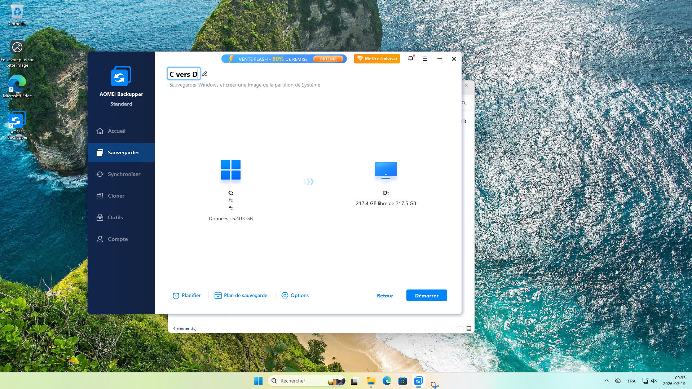
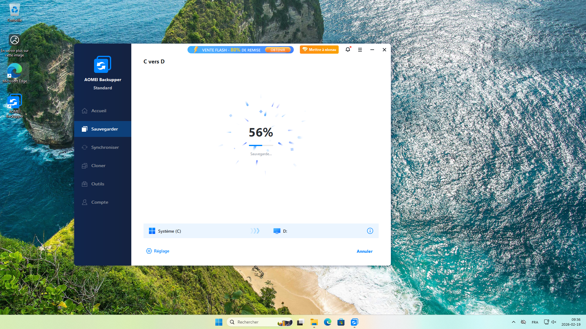
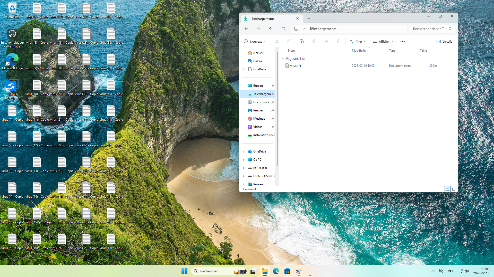
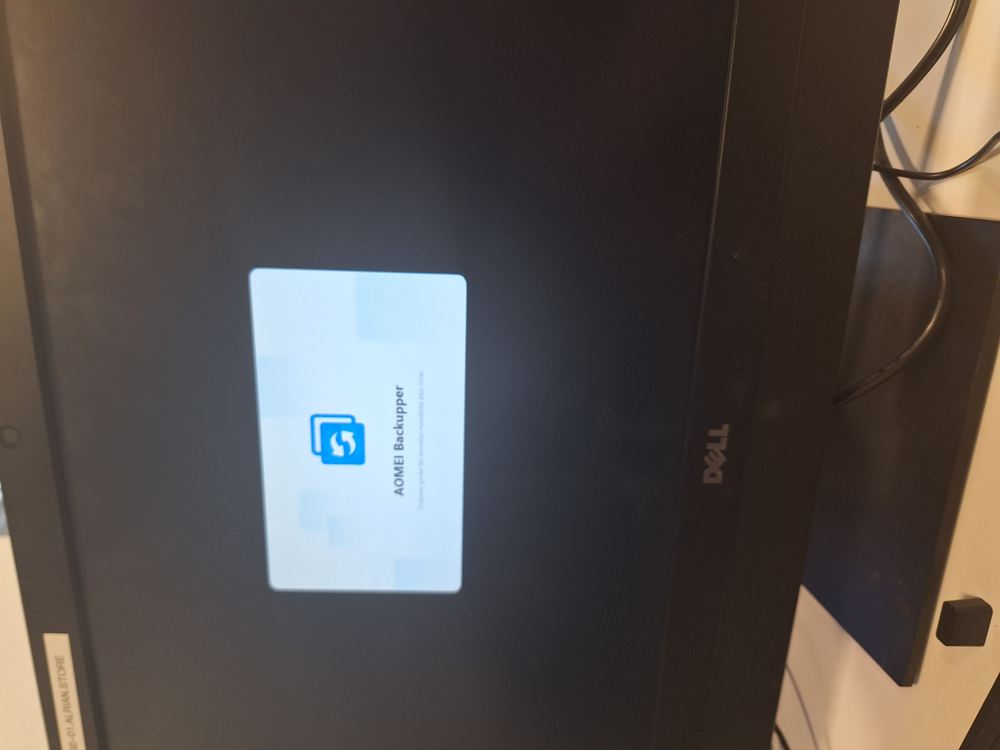
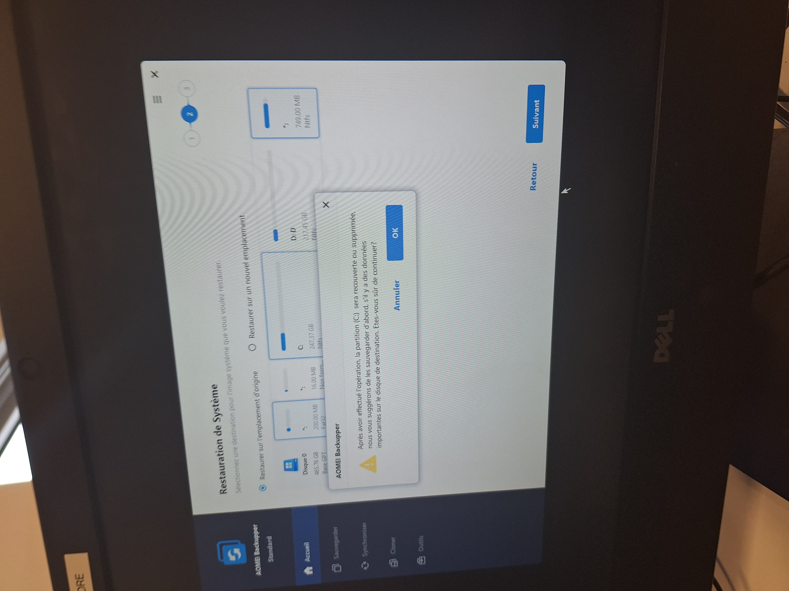
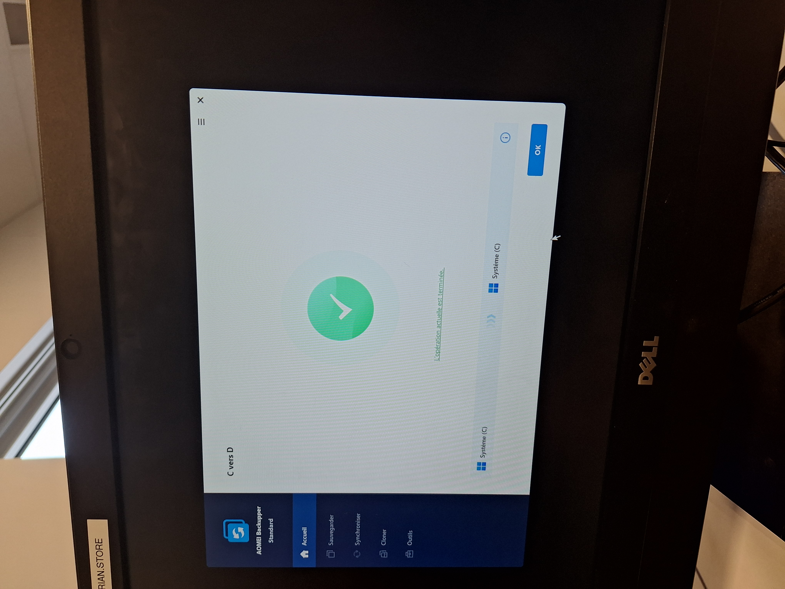

# Livrable 16 - Configuration d'un système de capture et de restauration d'image disque

## Objectif
Mettre en place un outil de capture et de restauration d'une image système afin de faciliter le déploiement et la récupération rapide d'une station de travail dans votre entreprise.

---

## 1. Capture d’une image système avec AOMEI Backupper Standard

### Pré-requis
- Station **PC-S0-01** entièrement configurée et mise à jour (Windows Enterprise).  
- Tous les logiciels requis du livrable 15 installés (Office 365, 7-Zip, Edge, etc.).  
- Partition **DATA (D:)** présente et exclue de la capture.  

### Instructions
1. Installer **AOMEI Backupper Standard** : [https://www.ubackup.com/free-backup-software.html](https://www.ubackup.com/free-backup-software.html)  
2. Lancer AOMEI Backupper depuis Windows.  
3. Sélectionner **Sauvegarde → Sauvegarde Système**.  
4. Choisir **C:** comme source.  
5. Définir **D:** comme destination pour stocker l’image.  
6. Cliquer sur **Démarrer la sauvegarde**.  
7. Vérifier l’intégrité de l’image via l’option **Vérifier l’image**.

**Capture d’écran / photo pendant la capture :**  

---

## 2. Création du disque de démarrage AOMEI Windows PE

1. Dans AOMEI Backupper, aller dans **Outils → Créer un support de démarrage**.  
2. Choisir **Windows PE** (recommandé).  
3. Sélectionner la **clé USB** pour créer le support.  
4. Lancer la création → attendre la fin.  

Résultat : clé USB bootable avec AOMEI Backupper prête pour la restauration.

---

## 3. Restauration de l’image système via clé USB Windows PE

1. Insérer la **clé USB Windows PE AOMEI** dans le PC à restaurer.  
2. Redémarrer le PC et ouvrir le **Boot Menu** (F12 sur Dell OptiPlex 7440).  
3. Sélectionner la **clé USB AOMEI** comme périphérique de démarrage.  
4. Dans Windows PE, ouvrir **AOMEI Backupper**.  
5. Aller dans **Restaurer → Restaurer une image système**.  
6. Sélectionner l’image sur **D:** comme source.  
7. Choisir **C:** comme partition de destination.  
8. Lancer la restauration.  
9. Retirer la clé USB et redémarrer normalement.  

**Capture d’écran avant la restauration avec des modifications non sauvegardées :** 

**photos pendant la restauration :**

**Capture d’écran après la restauration :** 

