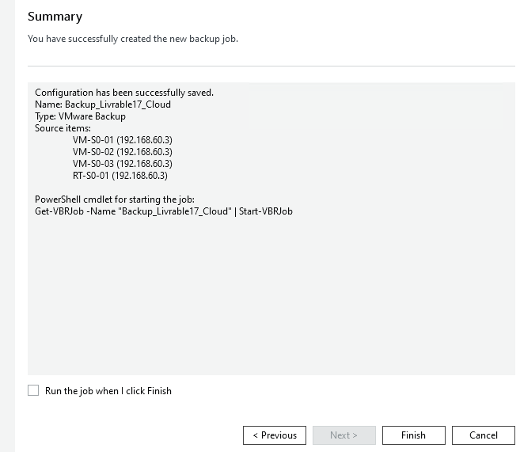
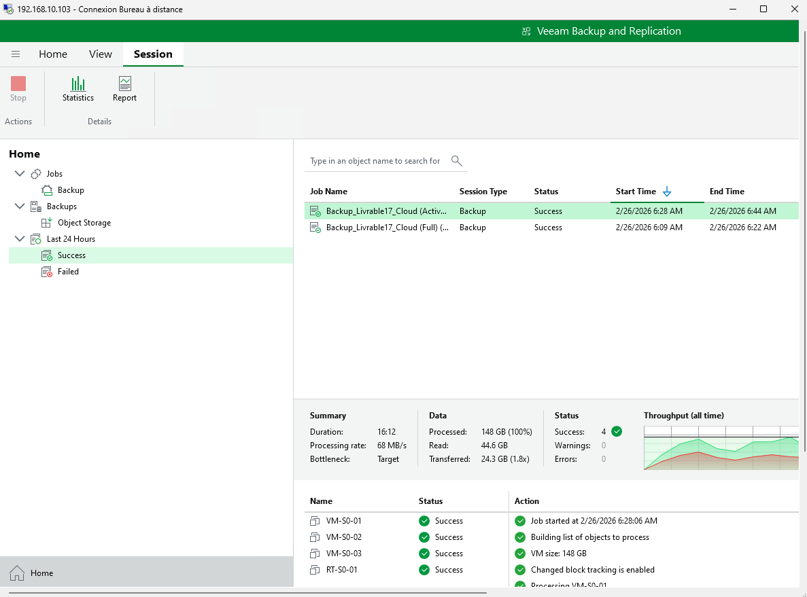
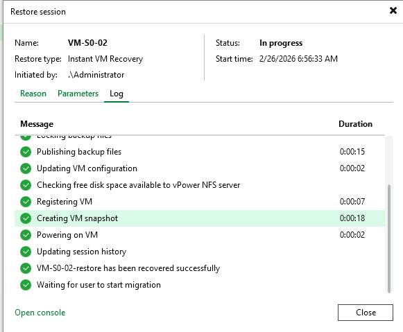
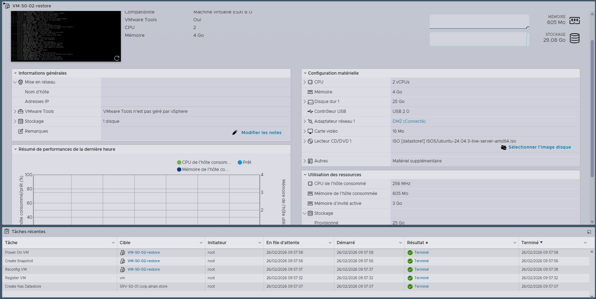

# Livrable 17 – Sauvegarde et Restauration

## 1. Outil de sauvegarde

**Veeam Backup & Replication 13** installé sur **Windows Server 2022**

### Justification
- Compatible VMware
- Sauvegarde vers Azure Blob Storage (mode objet)
- Gestion incrémentielle et full
- Restauration complète possible

---

## 2. Configuration des sauvegardes

- **Machines sauvegardées** : Toutes les VMs de l’infrastructure
- **Type de sauvegarde** : Full initial + incrémentiel quotidien
- **Planification** : Automatique, tous les jours à 22h
- **Rétention** : 7 points de restauration
- **Repository cible** : AzureBlob_VEEAM (Azure Blob Storage → conteneur `backups-esxi` → folder `TP_Livrable17`)

---

## 3. Fournisseur cloud et stockage

- **Fournisseur** : Microsoft Azure
- **Service** : Azure Blob Storage
- **Type** : Object Storage
- **Connexion** : HTTPS sécurisé via clé d’accès
- **Contenu du container** : fichiers `.vbk` (full), `.vib` (incremental), `.vbm` (metadata)

---

## 4. Exécution et vérification

- **Statut des backups** : Toutes les VMs sauvegardées avec succès
- **Accès cloud confirmé** : fichiers visibles dans Azure Portal

## 5. Captures d'écran

