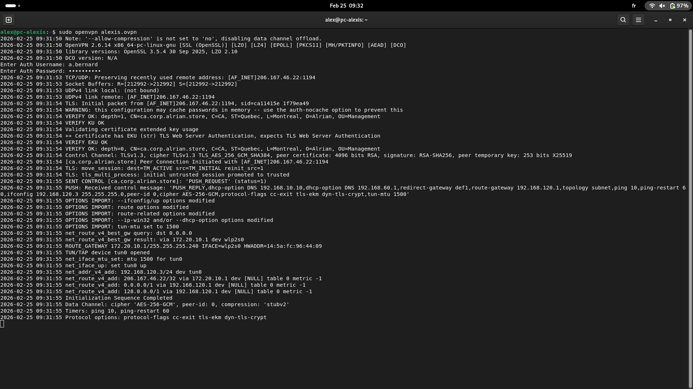
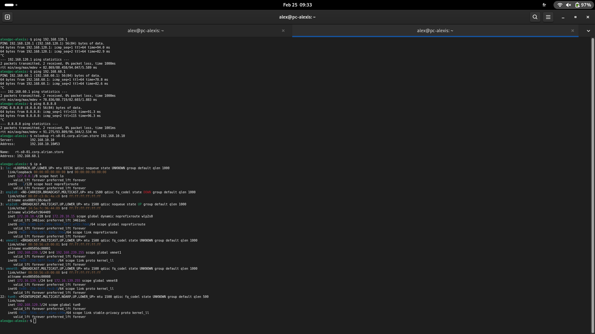
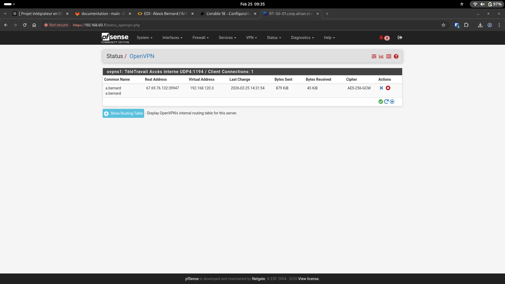

# livrable18-vpn.md — Livrable 18 : VPN de télétravail

## Choix du protocole VPN et logiciel utilisé
- Protocole : **OpenVPN**
- Serveur : **pfSense Community Edition** (OpenVPN Remote Access)
- Clients : OpenVPN (Linux/Windows) + OpenVPN Connect (iOS/Android)
- Paramètres principaux :
  - UDP/1194
  - Tunnel : 192.168.120.0/24 (client ex.: 192.168.120.2, gateway 192.168.120.1)
  - Domaine : corp.alrian.store
  - DNS poussés : 192.168.10.10 et 192.168.10.1
  - Full-tunnel : `redirect-gateway def1`

## Preuve de connexion réussie (capture d’écran)

## Comptes créés
- Chaque membre possède son propre compte VPN :
  - a.bernard
  - a.mindru
